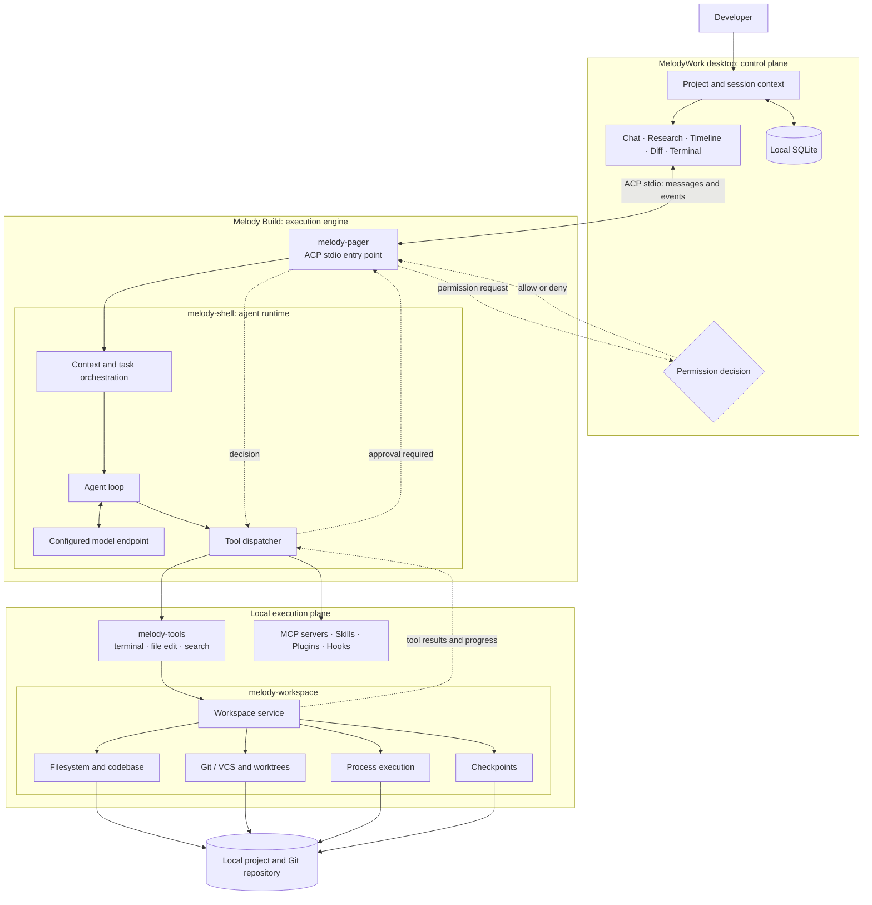

**English** | [简体中文](README.zh-CN.md)

# MelodyWork

> A local-first desktop workspace for building with [Melody Build](https://github.com/Lhy723/melody-build).

Talk through a task, inspect the result, review the diff, and ship directly from the project already on your machine. MelodyWork keeps the agent loop grounded in the repository, with visible tool activity and explicit permission boundaries.

[Development guide](docs/development.md) · [Release guide](docs/releasing.md)

`Local-first` `Git-native` `macOS` `Windows`

## Built for the Whole Loop

| Plan & Research | Build & Review | Control & Ship |
| --- | --- | --- |
| Start and resume ACP agent sessions, collect research context, and keep source material beside the implementation. | Inspect files and per-file Git diffs, edit within workspace boundaries, and work through a deliberate terminal. | Stage and commit changes, manage branches and worktrees, and decide permissions once, per session, or per project. |

## How Melody Build Works

Melody Build is the execution engine underneath MelodyWork. It is a terminal-based AI coding agent that can run interactively as a full-screen TUI, headlessly for scripts and CI, or embedded in another application through the Agent Client Protocol (ACP). MelodyWork provides the desktop control surface around that engine.



Solid arrows represent the execution path. Dashed arrows show events, tool results, and permission decisions flowing back to the desktop surface.

### One turn, end to end

1. You describe an outcome in MelodyWork and choose the project or worktree where it belongs.
2. MelodyWork starts or resumes `melody-pager` and opens an ACP stdio session with Melody Build.
3. The agent runtime reads the workspace, reasons about the task, and selects the tools it needs.
4. `melody-tools` performs terminal, file, search, and workspace operations. Permission-sensitive actions can pause for your decision.
5. Tool output and progress stream back through ACP, so the timeline stays inspectable while the agent works.
6. The resulting files remain in the local workspace. MelodyWork then gives you the Git diff, branch, worktree, and commit controls needed to review and deliver them.

This separation is intentional: Melody Build owns the agent loop and tool execution; MelodyWork owns the desktop experience, session navigation, project boundaries, review surfaces, and user decisions.

## Why This Shape

- **Local-first:** projects, session state, files, Git history, tool activity, and project rules stay on the machine where the work happens.
- **Protocol-driven:** ACP stdio gives the desktop client a clear boundary around messages, tool calls, progress, and permissions.
- **Inspectable by default:** the agent can move quickly, but changes remain visible through timelines, file previews, diffs, and Git actions.
- **Composable engine:** the same Melody Build runtime can power the terminal, CI, or another ACP client; MelodyWork focuses on making the desktop loop coherent.

The current beta has no account system or cloud sync.

## Getting Started

MelodyWork is currently built from source. You will need Node.js 22, pnpm, Rust, [DotSlash](https://dotslash-cli.com), ripgrep, and the Tauri 2 system dependencies for your platform.

Melody Build is pinned as the `vendor/melody-build` Git submodule. On a fresh clone:

```bash
git submodule update --init --recursive
pnpm install
cargo install dotslash --locked
pnpm tauri dev
```

See the [development guide](docs/development.md) for validation commands and sidecar behavior.

## Documentation

- [Development guide](docs/development.md): prerequisites, commands, and sidecar resolution
- [Release guide](docs/releasing.md): tags, updater signing, and platform release notes

## Contributing

Contributions are welcome. Before opening a pull request:

1. Keep the change focused and explain the user-facing behavior it changes.
2. Run `pnpm check`, `pnpm test:unit`, `pnpm build`, and `cargo test --manifest-path src-tauri/Cargo.toml` when the change touches the relevant surface.
3. Include or update tests and documentation when behavior or public workflows change.
4. Do not commit generated sidecars, build output, credentials, or updater private keys.

For bugs, include the operating system, reproduction steps, expected behavior, and relevant logs. For larger changes, open an issue first so the implementation can stay aligned with the project direction.

## License

MelodyWork does not currently declare a license. Until a `LICENSE` file is added, the source is not granted for redistribution or modification.
