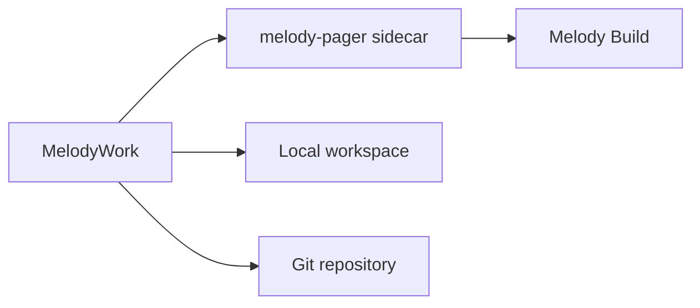

**English** | [简体中文](README.zh-CN.md)

# MelodyWork

> A local-first desktop workspace for building with [Melody Build](https://github.com/Lhy723/melody-build).

Talk through a task, inspect the result, review the diff, and ship directly from the project already on your machine. MelodyWork keeps the agent loop grounded in the repository, with visible tool activity and explicit permission boundaries.

[Get the latest beta](https://github.com/Lhy723/MelodyWork/releases) · [Development guide](docs/development.md) · [Release guide](docs/releasing.md)

`Local-first` `Git-native` `macOS` `Windows`

## Built for the Whole Loop

| Plan & Research | Build & Review | Control & Ship |
| --- | --- | --- |
| Start and resume ACP agent sessions, collect research context, and keep source material beside the implementation. | Inspect files and per-file Git diffs, edit within workspace boundaries, and work through a deliberate terminal. | Stage and commit changes, manage branches and worktrees, and decide permissions once, per session, or per project. |

## How It Fits Together



Everything that matters stays close to the work: projects, session state, files, Git history, tool activity, and project rules are local. The current beta has no account system or cloud sync.

## Start Developing

MelodyWork pins Melody Build as the `vendor/melody-build` Git submodule. On a fresh clone:

```bash
git submodule update --init --recursive
pnpm install
cargo install dotslash --locked
pnpm tauri dev
```

See the [development guide](docs/development.md) for prerequisites, validation commands, and sidecar behavior.

## Documentation

- [Development guide](docs/development.md): prerequisites, commands, and sidecar resolution
- [Release guide](docs/releasing.md): tags, updater signing, and platform release notes
- [File preview handoff](docs/handoff-file-preview.md): current file-preview implementation notes

## Status

MelodyWork is an active beta for macOS and Windows. The product surface and release workflow are evolving, while the local-first and Git-native foundation remains the point.
