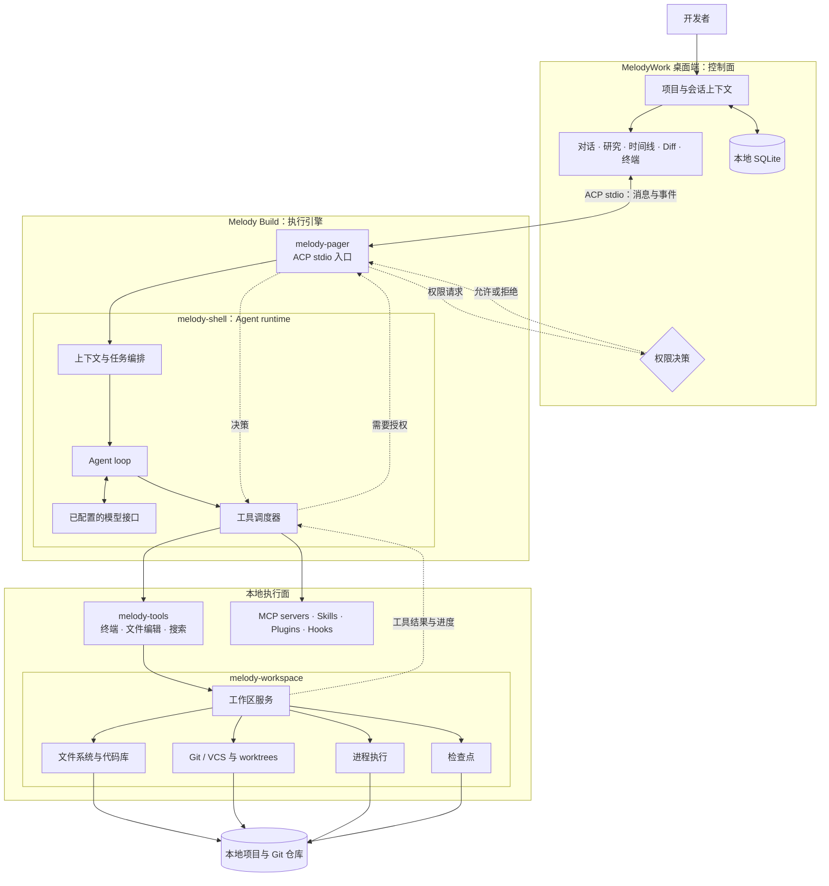

[English](README.md) | **简体中文**

# MelodyWork

> 一个面向 [Melody Build](https://github.com/Lhy723/melody-build) 的本地优先桌面工作台。

围绕任务与 Agent 对话，查看结果，审查 Diff，并直接在本地项目中交付。MelodyWork 让 Agent 工作闭环始终扎根于仓库：工具活动可见，权限边界明确，开发者始终保有控制权。

[开发指南](docs/development.md) · [发布指南](docs/releasing.md) · [文件预览交接说明](docs/handoff-file-preview.md)

`本地优先` `Git 原生` `macOS` `Windows`

## 覆盖完整工作闭环

| 规划与研究 | 构建与审查 | 控制与交付 |
| --- | --- | --- |
| 启动和恢复 ACP Agent 会话，收集研究上下文，并将来源材料保留在实现工作旁。 | 查看文件和逐文件 Git Diff，在工作区边界内编辑，通过集成终端有意识地执行命令。 | 暂存和提交变更，管理分支与 worktree，并按一次、会话或项目范围决定权限。 |

## Melody Build 的工作方式

Melody Build 是 MelodyWork 底层的执行引擎。它是一个终端型 AI coding agent：可以作为全屏 TUI 交互运行，也可以用于脚本和 CI 的 headless 模式，或者通过 Agent Client Protocol（ACP）嵌入其他应用。MelodyWork 则为它提供完整的桌面控制面板。



实线表示执行路径；虚线表示事件、工具结果和权限决策如何返回桌面端。

### 一个任务如何完成

1. 你在 MelodyWork 中描述目标，并选择任务所属的项目或 worktree。
2. MelodyWork 启动或恢复 `melody-pager`，通过 ACP stdio 与 Melody Build 建立会话。
3. Agent runtime 读取工作区，分析任务，并选择需要使用的工具。
4. `melody-tools` 执行终端、文件、搜索和工作区操作；涉及权限的动作可以暂停并等待你的决定。
5. 工具输出和进度通过 ACP 流回 MelodyWork，时间线会持续展示整个执行过程。
6. 结果文件仍然留在本地工作区。MelodyWork 再提供 Git Diff、分支、worktree 和提交控制，让你审查并交付改动。

这种分层是有意设计的：Melody Build 负责 Agent loop 和工具执行；MelodyWork 负责桌面体验、会话导航、项目边界、审查界面和用户决策。

## 为什么这样设计

- **本地优先：** 项目、会话状态、文件、Git 历史、工具活动和项目规则都保留在实际工作的本机上。
- **协议驱动：** ACP stdio 为消息、工具调用、进度和权限建立清晰边界。
- **默认可审查：** Agent 可以快速工作，但所有改动都能通过时间线、文件预览、Diff 和 Git 操作查看。
- **执行引擎可组合：** 同一个 Melody Build runtime 也可以服务于终端、CI 或其他 ACP 客户端；MelodyWork 专注于把桌面工作闭环组织好。

当前 beta 没有账号系统或云同步。

## 开始开发

MelodyWork 通过 `vendor/melody-build` Git submodule 固定 Melody Build。首次克隆后执行：

```bash
git submodule update --init --recursive
pnpm install
cargo install dotslash --locked
pnpm tauri dev
```

环境要求、验证命令和 sidecar 行为请参阅[开发指南](docs/development.md)。

## 文档

- [开发指南](docs/development.md)：环境要求、常用命令和 sidecar 查找顺序
- [发布指南](docs/releasing.md)：标签发布、updater 签名和平台发布说明
- [文件预览交接说明](docs/handoff-file-preview.md)：当前文件预览实现说明

## 项目状态

MelodyWork 是面向 macOS 和 Windows 的活跃 beta。产品界面和发布流程仍在持续完善，但本地优先、Git 原生始终是它的核心。
