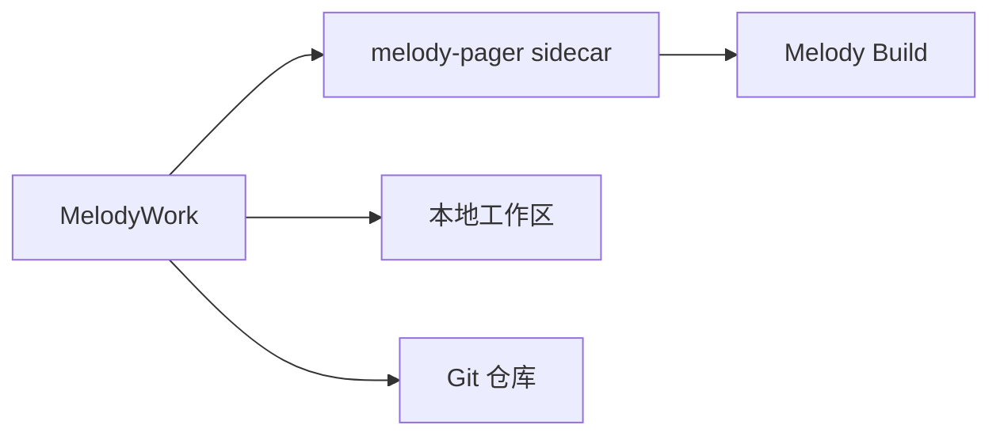

[English](README.md) | **简体中文**

# MelodyWork

> 一个面向 [Melody Build](https://github.com/Lhy723/melody-build) 的本地优先桌面工作台。

围绕任务与 Agent 对话，查看结果，审查 Diff，并直接在本地项目中交付。MelodyWork 让 Agent 工作闭环始终扎根于仓库：工具活动可见，权限边界明确，开发者始终保有控制权。

[获取最新 Beta](https://github.com/Lhy723/MelodyWork/releases) · [开发指南](docs/development.md) · [发布指南](docs/releasing.md)

`本地优先` `Git 原生` `macOS` `Windows`

## 覆盖完整工作闭环

| 规划与研究 | 构建与审查 | 控制与交付 |
| --- | --- | --- |
| 启动和恢复 ACP Agent 会话，收集研究上下文，并将来源材料保留在实现工作旁。 | 查看文件和逐文件 Git Diff，在工作区边界内编辑，通过集成终端有意识地执行命令。 | 暂存和提交变更，管理分支与 worktree，并按一次、会话或项目范围决定权限。 |

## 工作方式



项目、会话状态、文件、Git 历史、工具活动和项目规则都保留在离工作最近的地方：本机。当前 beta 没有账号系统或云同步。

## 开始开发

MelodyWork 通过 `vendor/melody-build` Git submodule 固定 Melody Build。首次克隆后执行：

```bash
git submodule update --init --recursive
pnpm install
cargo install dotslash --locked
pnpm tauri dev
```

环境要求、验证命令和 sidecar 行为请参阅[开发指南](docs/development.md)。

## 文档

- [开发指南](docs/development.md)：环境要求、常用命令和 sidecar 查找顺序
- [发布指南](docs/releasing.md)：标签发布、updater 签名和平台发布说明
- [文件预览交接说明](docs/handoff-file-preview.md)：当前文件预览实现说明

## 项目状态

MelodyWork 是面向 macOS 和 Windows 的活跃 beta。产品界面和发布流程仍在持续完善，但本地优先、Git 原生始终是它的核心。
