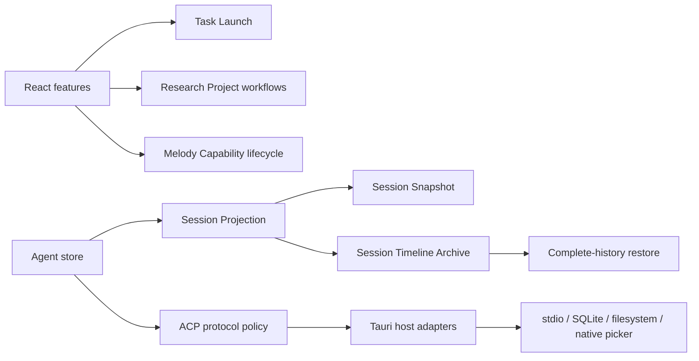

# MelodyWork 架构改进复评与推进记录

更新日期：2026-08-23

## 结论

本轮复评认为，项目当前最值得投入的方向不是按技术层继续拆文件，而是把跨 store、UI、Tauri command 的业务不变量收进少量“深模块”。已按风险和收益顺序完成五项改进：Session Projection、Research Project 工作流、Task Launch、ACP 权限协议、Melody Capability 生命周期。

这些改动保持现有产品行为和 Tauri 边界不变，重点减少重复状态转换、时序分叉和隐含安全规则。新的核心规则均可在本地用纯逻辑或内存 adapter 测试。

### 完整历史保留契约

Session Snapshot 仍然只负责快速恢复，因此继续保留 2 MiB 上限；完整的
Session Projection 由 Session Timeline Archive 单独追加保存。每个 entry 使用
稳定 ordinal 写入 SQLite，更新同一 ordinal 时覆盖该 entry 的最新投影，避免把
每个流式 token 都变成一条记录。更新快照、ACP cursor 和归档 entry 在同一个
事务中提交；恢复时优先读取归档；只有未裁剪快照且归档结构完整时才会沿用旧
ACP cursor，否则先展示归档并让 ACP 重放校验运行态，快照只作为归档不可用时的
安全降级路径。

这保证的是完整的展示投影历史，而不是 ACP 原始 wire event 或每个 token delta。
删除 Agent Session 时，归档随 Session 一起级联删除；除此之外没有自动容量上限或
保留期。

## 已完成的优先序列

| 顺序 | 领域               | 原问题                                                                          | 当前边界                                                                                       | 验证重点                                           |
| ---- | ------------------ | ------------------------------------------------------------------------------- | ---------------------------------------------------------------------------------------------- | -------------------------------------------------- |
| 1    | Session Projection | store 与 reducer 各维护一套事件投影，测试依赖大量回调                           | `session-projection.ts` 直接拥有消息、思考、工具、用量、失败与权限请求的投影规则               | 真实 timeline 结果、版本恢复、事件去重             |
| 2    | Research Project   | 搜索结果、历史、追踪主题和论文集合由 UI 分步更新，容易产生半完成状态            | research store 提供原子 `recordSearchResult` 与 `refreshTrackingTopic` 工作流                  | 项目隔离、论文身份保留、追踪刷新一致性             |
| 3    | Task Launch        | 新任务和 Research prompt 分别维护 pending ref/effect，存在重复投递风险          | `TaskLauncher` 统一创建、排队、ready 对齐与一次性投递                                          | session 对齐、at-most-once、使用真实创建结果       |
| 4    | ACP Policy         | 进程桥接、JSON-RPC 校验、pending request、权限选项和宿主确认混在一个 command 中 | `acp_policy.rs` 拥有协议与 pending 生命周期；Tauri 层只负责 workspace、SQLite 和 stdio，确认由应用内权限卡片处理 | 方法白名单、MCP 注入、TTL/容量、响应匹配、权限选项 |
| 5    | Melody Capability  | 设置页自行组合发现/安装结果和刷新规则，Rust 配置同时维护互斥状态集合            | 前端 lifecycle 统一发现、合并与刷新；Rust lifecycle 统一 enabled/disabled 不变量               | 插件身份优先、技能刷新时序、配置集合一致性         |

## 当前结构



设计上的共同点是：对外接口表达一个完整结果，模块内部持有状态转换；文件系统、进程、数据库和 UI 只作为 adapter，不拥有领域规则。

## 关键不变量

### Agent Session

- Session event 只能通过 Session Projection 形成展示记录。
- 同一事件 ID 在同一 Agent Session 内只投影一次。
- Task Launch 只有在 workspace session 与 agent session 同一且 ready 时才投递。
- prompt 从 pending map 移除后再发送，避免并发 effect 重复投递。

### Research Project

- 搜索结果与搜索历史属于一次原子工作流。
- Tracking Topic 刷新同时更新论文集合、`paperIds`、最新数量和检查时间。
- 已收藏论文的身份和收藏状态不会被新搜索结果覆盖。

### ACP 与 Permission Request

- renderer 只能发送明确允许的方法，且消息不得超过 1 MB。
- session 方法必须携带所需的 `cwd` 或 `sessionId`。
- ACP 不允许注入 MCP server；高权限模式仍受权限模式和 workspace 校验约束，用户确认在应用内完成。
- Permission Request 只能选择该请求提供的 allow/reject option。
- pending server request 有 10 分钟 TTL 和 256 条容量上限；校验失败会回填，供用户修正后重试。

### Melody Capability

- plugin 启用时从 `disabled` 移除并加入 `enabled`；停用时执行相反转换。
- skill 只使用 `disabled` 集合，不写入 plugin 专属的显式启用集合。
- 已安装 plugin 与扫描结果路径相同时，已安装记录优先。
- skill 状态写入成功后重新读取 runtime catalog；plugin 状态切换不做无意义的重复扫描。

## 下一阶段建议

本轮复评时列出的 Session persistence schema、Research source adapters 和
Settings async state 已全部完成。当前没有需要立即推进的架构阻塞项；后续如
产品继续扩展，再按真实变化选择新的 deepening 目标，不预先增加抽象层。

## 明确暂不做的事

- 不为追求目录整齐而按 controller/service/repository 机械分层。
- 不改变现有 ACP wire format 或 Tauri command 名称；确认交互统一在应用内完成，不再弹出原生确认框。
- 不在没有迁移计划时重写持久化格式。
- 不把文件系统或进程 adapter 暴露成新的公共 API。

## 验证方式

本轮使用以下命令作为完成标准：

```sh
pnpm check
pnpm check:architecture
pnpm test:unit
pnpm lint
pnpm format:check
pnpm build
cargo fmt --manifest-path src-tauri/Cargo.toml --all -- --check
cargo test --manifest-path src-tauri/Cargo.toml
git diff --check
```

测试数量会随项目继续增长；判断标准是所有测试通过，而不是固定数量。

## 本轮后续优化记录

在上述架构调整之后，又完成了一轮工程质量和加载性能修复：

- 所有 React Hook 依赖和异步闭包 warning 已通过 `useCallback`、真实依赖和稳定 memo 处理；没有新增 lint warning。
- 清理了 Markdown renderer、文件附件和旧版设置迁移中的未使用变量。
- Monaco React wrapper 与 Monaco runtime 统一放入共享动态入口，只在打开文件预览或编辑器时加载。
- Shiki 高亮器改为异步加载，主入口不再静态携带整个高亮 runtime。
- 研究搜索与追踪刷新使用 `RequestGate` 标记最新请求；慢请求、页面离开或重复操作不会覆盖较新的结果。
- `format:check` 已纳入本轮触及的文件，避免新增模块绕过格式检查。
- CI 的 Check workflow 已固定执行类型检查、前端单测、Lint、格式检查和生产构建，避免架构回归只在本地被发现。
- 新增 `check:architecture` 契约检查，确保 `src/domain` 不反向依赖 UI、store、lib 或 Tauri/React runtime。
- `config_runtime.rs` 的配置文件读写已收口到 `TextFileStore`，采用大小限制、UTF-8 校验、临时文件同步和替换写入；技能删除使用真实目录检查，Melody sidecar 的二进制、工作目录和环境变量由 `MelodyCommandRunner` 统一配置。
- Session 持久化已写入 SQLite `user_version`，现有 `acp_cursor`、`timeline_version` 与 `session_timeline_entries` 通过可重入迁移补齐；旧快照会在 v4 迁移时回填为归档 entry，遇到更新版本的数据库会拒绝继续写入，避免静默破坏数据。
- timeline 快照与归档解码都会校验最小 entry 结构；损坏投影只保留健康条目供只读回退，并禁止带游标恢复，优先让 ACP 重放，避免坏 JSON 或半条目污染运行态。
- Research 来源请求已收口到 `ResearchSourceClient`：每个来源拥有独立超时、重试退避、最小请求间隔和有上限的成功响应缓存；Research Project 工作流只处理来源结果，不再感知网络策略。
- Settings 异步操作已通过 `useAsyncOperation` 统一 latest-request、pending/error 生命周期；配置、扩展、权限规则加载互不覆盖，插件安装/更新/卸载和详情刷新也不会让过期结果回写当前页面。
- Session Snapshot 已增加前端压缩与 2 MiB 硬上限：仅保留最近 400 条 projection entry，并裁剪工具输出、diff、附件 URL 等高增长字段；完整 timeline 同时写入独立归档表，快照裁剪时将 version 标记为 0，归档仍用于完整展示，但只有未裁剪快照和完整归档同时可用时才会使用原 ACP cursor 恢复。
- SQLite `update_session` 现在在写入边界再次校验 timeline 必须是 JSON 数组且不超过 2 MiB；即使 renderer 逻辑回归，也不会把超大或错误形状的数据写入持久层。
- Application Error 已成为 UI 的统一错误出口，网络、超时、权限、存储、协议、冲突和不存在等错误获得一致的用户提示，同时保留可执行的输入校验文案。
- Markdown/mermaid renderer 改为首次显示消息时才加载，初始入口从约 2.5 MiB 降到约 1.0 MiB；Monaco、终端、ECharts 和语言包仍保持按功能按需加载。
- Vite 将 Radix 与 Motion 稳定依赖拆为可缓存 vendor chunk，功能入口变化不会重复下载 UI 框架代码。

构建仍会报告 Monaco editor 本体、部分 Shiki 语言包和 wasm chunk 超过 500 KB；这些是对应功能的按需 chunk，不会进入初始入口。统计页的 ECharts 已按核心、组件、图表和 renderer 拆分，单个 chunk 已降到 500 KB 以下。剩余体积属于编辑器语言包和 wasm 运行时，继续缩小需要改变功能粒度，暂不通过提高 warning 阈值掩盖体积。
